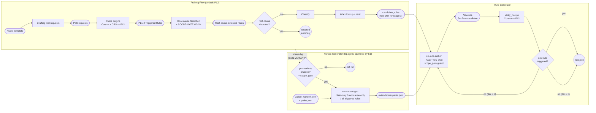

# CRS Rule Generation Workflow

## Overview

Pipeline tự động phân tích Nuclei templates và đề xuất hành động phù hợp trên CRS ruleset: tạo rule mới khi gap tồn tại.

Khác biệt cốt lõi với pipeline keyword-match thông thường: **coverage được quyết bằng engine thật, không phải bằng grep**. Stage 1 dựng request thật từ template rồi cho chạy qua CRS ruleset nhúng trong Coraza (probe-engine) ở PL2 — engine là oracle. "CRS đã cover chưa?" trở thành "có rule nào *bắt đúng root cause* khi probe không?", một câu hỏi có ground truth thay vì suy đoán.

---

## Flow Diagram

Legend: `([...])` = artifact, `[...]` = process, `((...))` = terminal. Stage 2 được Stage 1 spawn tại bước GEN-VARIANTS — chạy nền song song, không block Stage 1 tiếp tục RETRIEVE → EMIT. Stage 3 nhận từ cả hai: `candidate_rules` (Stage 1) + `extended-requests.json` (Stage 2).

---

## Stage Descriptions

### Stage 1 — `crs-retrieve-analyze` (engine-as-oracle)

Coverage analysis cho **MỘT** Nuclei template. Write-only: toàn bộ kết quả serialize vào `out/<id>/verdict.json`, chỉ in một dòng confirmation. Tuần tự nghiêm ngặt theo state machine:

**Covered branch:** `CRAFT → PROBE → adjudicate → INSPECT-ROOT-CAUSE → VARIANT-HANDOFF → GEN-VARIANTS → EMIT`

**Not-covered branch:** `CRAFT → PROBE → adjudicate → SCOPE-GATE → VARIANT-HANDOFF → GEN-VARIANTS → RETRIEVE → EMIT`

#### 1. Craft test requests (CRAFT)

Đọc template, quyết định request(s) nào **mang payload exploit** (bỏ qua request discover/setup vì probe-engine chạy mỗi request như một transaction độc lập, không session). Dựng request thật và ghi ra `out/<id>/probe-input.json` (batch `requests[]`, mặc định PL2). Ghi `injection_point` dạng **plain** (request nào + param/header/body mang payload) và `injection_slot` (ModSec request-variable string — vd `REQUEST_HEADERS:Authorization`, `ARGS_GET:uid`, `REQUEST_BODY`; machine handoff cho variant-gen + rule-author scope rule).

#### 2. Probe Engine — Coraza-based, PL2 (PROBE)

Cho request(s) chạy qua **CRS ruleset thật nhúng trong Coraza**. Output: `matched_rules` + anomaly score mỗi request. Đây là **oracle** — thay thế suy đoán bằng keyword.

Pipeline file tường minh: model `Write` probe-input → `probe-engine.exe --crs coreruleset < input > probe-raw.json` → `parse_probe.py` chiếu về whitelist field → model chỉ đọc `probe.json`. `probe-raw.json` là pure staging (auto-xoá sau khi `probe.json` ghi xong).

#### 3. Adjudicate — "root-cause rule fired?"

Với mỗi rule đã fire, phán nó có phải **root cause** không, xét tình huống thực:
1. `tags` chứa `attack-<class>` khớp class của template, **và**
2. **bắt đúng exploit** — fire trên đúng request thực thi exploit, tại payload location, detection đủ generic.

`root_cause_rules` non-empty ⟺ **covered**.

#### 4a. INSPECT-ROOT-CAUSE — chỉ chạy khi covered

Với mỗi root-cause rule, drill vào **cơ chế bắt cụ thể** (operator type, transforms, key pattern, token trigger), cross-reference `variables[].value` từ probe. Kết quả: `rule_analysis[]` (per-rule: `id/msg/operator/transforms/pattern_excerpt/matched_at/trigger_explanation`) → nuôi `recommendation` ở EMIT.

Exception: được `Read` targeted rule block (`offset=line-1, limit=40`) **chỉ khi** index row có `operator`=`@rx` HOẶC `chain`=1. Operator khác và `chain`=0 → index row đã đủ. Scope cứng: **chỉ root-cause rules**.

#### 4b. SCOPE-GATE — chỉ chạy khi not-covered (sau adjudication, trước VARIANT-HANDOFF)

Quyết xem gap có nằm **trong tầm content-inspection của WAF** không. Đọc theo thứ tự, dừng tại dòng kết luận được đầu tiên (short-circuit):

| # | Câu hỏi | → Kết luận |
|---|---------|-----------|
| G0 | Có root-cause rule không? (precondition — KHÔNG vào gate nếu có) | covered → không vào gate |
| G1 | Request exploit có mang **token nội dung bất thường** không? (injection metachar, traversal `../`, string known-bad) | **có** → `in-scope` |
| G2 | Detect có **bắt buộc app-specific state** WAF không thể biết không? (session, quyền sở hữu, business rule) | → G4 nếu có |
| G3 | injection_slot có **payload cụ thể để variant-gen mutate** không? | vắng mặt → G4 |
| G4 | Có thể diễn đạt bằng **signature CVE-cứng deterministic** không? (path cố định + điều kiện vắng header) | **có** → `virtual-patch-only` · không → `out-of-scope-structural` |

Bốn terminal: `covered` · `in-scope` · `virtual-patch-only` · `out-of-scope-structural`. Kết quả ghi vào `scope_gate` trace trong verdict. **Chỉ `in-scope`** mới cho phép spawn variant-gen.

#### 5. VARIANT-HANDOFF — luôn chạy (sau INSPECT-ROOT-CAUSE hoặc sau SCOPE-GATE)

**Luôn write `variant-handoff.json`** bất kể covered/not-covered và `gen-variants` mode. File là partial context cho bg agent crs-variant-gen: `classification` (gồm `injection_slot`), `payload_samples`, `root_cause_rules`, `rule_analysis`, `scope_gate`.

#### 6. GEN-VARIANTS — spawn bg Agent (CHỈ theo arg `gen-variants`, độc lập coverage)

Spawn bg Agent(crs-variant-gen) **chỉ dựa trên arg `gen-variants`** — không phụ thuộc covered/not-covered hay force-candidates. Ngoại lệ: `scope_gate.decision` ∈ {`virtual-patch-only`, `out-of-scope-structural`} → **suppress spawn** (mutate vô nghĩa khi exploit không có content signature).

| `gen-variants` | Hành động |
|---|---|
| `off` | KHÔNG spawn; EMIT tự write PoC-only `extended-requests.json`. |
| `class-only` (default) | Spawn crs-variant-gen `--gen-variants=class-only`. |
| `root-cause-only` | Spawn, neo `root_cause_rules` (fallback class-only nếu no root cause). |
| `all-triggered-rules` | Spawn, neo toàn bộ `matched_rules` (fallback class-only nếu nothing fired). |

Agent chạy nền; main thread tiếp tục RETRIEVE → EMIT (not-covered), hoặc EMIT thẳng (covered + không force-candidates).

#### 7. RETRIEVE — chạy khi Stage 2 cần material (not-covered, hoặc covered + force-candidates)

Classify vuln-class đầy đủ, chọn file CRS từ catalog, gom **related rules**:
- **Engine-identified:** rule đã fire ở probe nhưng off-root-cause — tín hiệu "related" mạnh nhất.
- **CVE:** template có CVE ID → grep `coreruleset/rules/` theo chuỗi CVE (best-effort, ~23 CVE toàn corpus, chỉ ở comment).
- **Index-identified:** rule cùng class **không** fire, rank theo 4 criteria: **scope** (variables ∩ injection_point), **operator+transform**, **phase**, **pl** (tie-break).

Kết quả: `candidate_rules[]` (`id/file/line/operator/pl/why`), **rank theo độ liên quan**, ≤5. Source location lấy từ `index/<fileid>.tsv` theo `id` — KHÔNG grep regex body `.conf`.

#### Output Stage 1: `out/<id>/verdict.json`

Model write `analysis.json` (chỉ judgment; pure staging, auto-xoá sau assemble); `assemble_verdict.py` inject probe transcript → `verdict.json`. Cấu trúc:
- **covered**: `root_causes.root_cause_rules[]` + `root_causes.recommendation` (structured: `summary` + `pl_coverage` + `rule_analysis[]`), `candidate_rules: []`.
- **not-covered**: `root_causes: null`, `candidate_rules[]` (ranked), `classification.injection_point` + `injection_slot`, `payload_samples`, `scope_gate` trace.

Artifacts của mỗi template (ở `out/<id>/`):

| File | Bước | Vai trò | Vòng đời |
|---|---|---|---|
| `verdict.json` | EMIT | **deliverable duy nhất** | giữ — Stage 2 đọc |
| `extended-requests.json` | GEN-VARIANTS / EMIT | handoff cho Stage 2 (PoC + variants) | giữ — Stage 2 đọc |
| `variant-handoff.json` | VARIANT-HANDOFF | handoff cho crs-variant-gen | giữ (trace/re-run) |
| `probe.json` | PROBE | probe đã projection; nhúng trong verdict | giữ (trace/re-run) |
| `probe-input.json` | CRAFT | envelope PoC; variant-gen clone | giữ (trace/re-run) |
| `probe-raw.json` | PROBE-1 | raw engine output | **auto-xoá** sau `probe.json` |
| `analysis.json` | EMIT | judgment model, pure staging | **auto-xoá** sau `verdict.json` |

> **Force-candidates mode** (tùy chọn, OFF mặc định): khi user yêu cầu tường minh, nhánh covered chạy **thêm** RETRIEVE sau INSPECT-ROOT-CAUSE → verdict giữ **cả** `recommendation` lẫn `candidate_rules` (loại trừ id đã là root-cause). Bật bằng `force_candidates: true` trong `analysis.json`; covered/not-covered **KHÔNG đổi**.

---

### Stage 2 — `crs-variant-gen` (bg agent, Lane 2)

**Được Stage 1 spawn** tại bước GEN-VARIANTS (sau VARIANT-HANDOFF), chạy nền song song với phần còn lại của Stage 1 (RETRIEVE → EMIT). Stage 1 không chờ Stage 2 — hai stage overlap về thời gian. Input: `variant-handoff.json` + `probe.json` (Stage 1 write trước khi spawn). Output: `extended-requests.json` (PoC + variants) — Stage 3 chờ file này.

#### crs-variant-gen

Sinh biến thể cùng attack-class theo `--gen-variants` mode. Chọn target rule để neo bypass (root-cause-only / all-triggered-rules), hoặc enumerate technique-spread của family (class-only — default). Mọi variant inject tại **đúng `injection_slot`** (ModSec var từ Stage 1) — KHÔNG dời sang slot khác. Encoding-layer (base64, JWT, hex) được tính bằng `encode_layer.py` — KHÔNG tự tính tay. Output: `extended-requests.json` (PoC + ≤6 variants, ≥2 kỹ thuật khác nhau).

### Stage 3 — `crs-rule-author` (Lane 3+4)

Bước **LLM synthesis + engine verify**. Input: `verdict.json` (Stage 1) distill qua `parse_verdict.py` → `author-context.json` + Nuclei template gốc + `extended-requests.json` (Stage 2). Verify bằng `verify_rule.py` (Lane 4) — max 3 vòng. Output: `out/<id>/new.json`.

#### crs-rule-author (Lane 3)

Sau khi đọc `author-context.json`, kiểm **scope_gate guard trước tiên**:
- `scope_gate.decision ∈ {out-of-scope-structural, virtual-patch-only}` → HALT, không synthesize.
- `covered` **và** `candidate_rules == []` → HALT (CRS đã cover, không có related rule để bổ sung).
- `not-covered` → greenfield synthesis bình thường.
- `covered` **và** `candidate_rules` non-empty (force-candidates) → **complementary mode**: rule mới nhắm phần `already_covered_by` chưa phủ (gap PL1, hoặc class khác); TUYỆT ĐỐI không nhân bản rule đã cover.

Thiết kế: variable scope (ưu tiên `engine_confirmed_var` từ probe), operator, transform pipeline (baseline `t:none,t:urlDecodeUni,t:lowercase`), phase, anomaly scoring. Rule ID dùng **placeholder** `<fileID>XXX` — không resolve exact. Metadata theo tier:
- **Tier 1 (luôn emit):** `id`, `phase`, `block`, `severity`, anomaly `setvar`, `tag:'paranoia-level/N'` (PL>1).
- **Tier 2 (emit):** `msg`, `logdata`.
- **Tier 3 (SKIP trừ khi release-ready):** `ver`, `rev`, classification tags, `maturity`, `accuracy`.

#### verify_rule.py (Lane 4)

Engine chấm rule candidate trên `extended-requests.json`. Gate:
- `parse_ok: false` → loop về SYNTHESIZE (fix syntax; iter không tăng).
- `triggered: false` & iter < 5 → loop về DESIGN (tăng iter).
- `triggered: false` & iter = 5 → EMIT với residual gap (confidence hạ).
- Mọi `triggered: true` → EMIT (pass).

> Engine constraint: `--candidate-rule-file` load sau rule 949 → trigger xác nhận được, anomaly scoring KHÔNG được 949 đếm trong cùng run. VERIFY chỉ xác nhận **trigger/fire**, không xác nhận scoring/block.

---

## Output: Recommendations

Stage 2 ghi **một artifact duy nhất**:

| File | Type | Sinh bởi | Mô tả |
|------|------|----------|--------|
| `out/<id>/new.json` | `new` | `crs-rule-author` | Tạo rule mới — greenfield hoặc complementary |

Nhánh **covered** (Stage 1, không force-candidates) không chạy Stage 2 — recommendation nằm trong `root_causes.recommendation` của `verdict.json`. Nhánh **scope_gate ∈ {virtual-patch-only, out-of-scope-structural}** cũng không chạy Stage 2 — lý do ghi trong `scope_gate.rationale` của verdict.

---

## Key References

| Cần biết về... | Xem ở... |
|----------------|----------|
| SecRule syntax, metadata fields | `comibined-docs/CRS-contents/3-about-rules-distillation/` |
| Operators, variables, transforms | `comibined-docs/modsec-docs/` |
| Anomaly scoring pattern | `comibined-docs/CRS-contents/2-how-crs-works-distillation/` |
| Chaining, regex conventions | `comibined-docs/CRS-contents/6-development-distillation/` |
| Nuclei template format | `comibined-docs/nuclei-docs/nuclei-template-format.md` |
| Attack technique catalog (variant-gen) | `comibined-docs/patt-category.md` |
| Existing CRS rules (few-shot source) | `coreruleset/rules/` |
| Rule metadata index (regex stripped) | `.claude/skills/crs-retrieve-analyze/index/<fileid>.tsv` |
